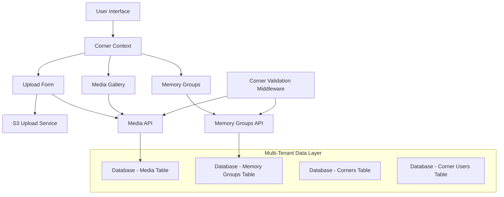

# Design Document

## Overview

This design addresses the critical issue where media uploads succeed to S3 but don't appear in the application due to missing corner association, and improves the overall multi-user environment. The core problem is that the current `UploadForm.tsx` doesn't include the `corner_id` when creating media records, while the new multi-tenant architecture requires all media to be associated with a specific corner.

The solution involves updating the upload flow to properly integrate with the corner context, enhancing data isolation across all operations, and improving user experience with better error handling and corner management.

## Architecture

### Current Architecture Issues

1. **Upload Form Gap**: The basic `UploadForm.tsx` doesn't use corner context or include `corner_id` in media creation
2. **Data Isolation**: Some API endpoints don't properly filter by corner ID
3. **Context Management**: Corner selection isn't consistently enforced across all operations
4. **Error Handling**: Limited feedback when corner-related operations fail

### Proposed Architecture



## Components and Interfaces

### 1. Enhanced Upload Form Component

**Purpose**: Replace the basic upload form with corner-aware functionality

**Key Changes**:
- Import and use `useCorner()` hook
- Display current corner information prominently
- Include `corner_id` in all media creation requests
- Disable upload when no corner is selected
- Show corner-specific error messages

**Interface**:
```typescript
interface EnhancedUploadFormProps {
  onUploadComplete?: () => void;
  allowedFileTypes?: string[];
  maxFileSize?: number;
}

interface UploadState {
  currentCorner: Corner | null;
  files: FileWithPreview[];
  uploadProgress: Record<string, number>;
  isUploading: boolean;
  errors: string[];
}
```

### 2. Corner-Aware Media Gallery

**Purpose**: Ensure media gallery only shows content from the current corner

**Key Changes**:
- Filter media by current corner ID
- Refresh when corner changes
- Show appropriate empty states
- Handle corner access errors gracefully

**Interface**:
```typescript
interface MediaGalleryProps {
  cornerId: string;
  refreshTrigger?: number;
}

interface MediaGalleryState {
  mediaItems: MediaItem[];
  loading: boolean;
  error: string | null;
  currentCorner: Corner | null;
}
```

### 3. Corner Validation Middleware

**Purpose**: Centralized corner access validation for API endpoints

**Implementation**:
```typescript
interface CornerAccessResult {
  hasAccess: boolean;
  user: FirebaseUser;
  corner: Corner;
  userRole: CornerRole;
}

async function validateCornerAccess(
  cornerId: string, 
  authHeader?: string
): Promise<CornerAccessResult>
```

### 4. Enhanced Corner Context

**Purpose**: Improved corner management with better error handling

**Key Enhancements**:
- Automatic corner restoration on app load
- Error state management
- Corner switching validation
- Persistent corner selection

## Data Models

### Updated Media Creation Flow

```typescript
// Enhanced CreateMediaItem with required corner_id
interface CreateMediaItem {
  corner_id: string; // Now required and validated
  memory_group_id?: string;
  filename: string;
  original_name: string;
  s3_key: string;
  s3_url: string;
  file_type: string;
  file_size: number;
  width?: number;
  height?: number;
  duration?: number;
  title?: string;
  note?: string;
  date_taken?: Date;
  sort_order?: number;
  uploaded_by_firebase_uid?: string;
}
```

### Corner Context State

```typescript
interface CornerContextState {
  currentCorner: Corner | null;
  userCorners: Corner[];
  pendingInvites: CornerInvite[];
  userRole: CornerRole | null;
  loading: boolean;
  error: string | null; // New error state
}
```

## Error Handling

### Upload Form Error Scenarios

1. **No Corner Selected**
   - Disable upload form
   - Show corner selection prompt
   - Provide link to corner selector

2. **Corner Access Denied**
   - Show permission error
   - Suggest contacting corner admin
   - Offer to refresh corner list

3. **Upload Failures**
   - Distinguish between S3 and database errors
   - Show specific error messages
   - Provide retry options

4. **Network Issues**
   - Show connection error
   - Implement retry logic
   - Cache form data for recovery

### API Error Responses

```typescript
interface ApiErrorResponse {
  error: string;
  code: 'CORNER_NOT_FOUND' | 'ACCESS_DENIED' | 'INVALID_CORNER' | 'UPLOAD_FAILED';
  details?: {
    cornerId?: string;
    requiredRole?: CornerRole;
    suggestion?: string;
  };
}
```

## Testing Strategy

### Unit Tests

1. **Upload Form Component**
   - Corner context integration
   - File selection and validation
   - Upload progress tracking
   - Error state handling

2. **Corner Context Hook**
   - Corner switching logic
   - Persistence functionality
   - Error state management
   - API integration

3. **API Endpoints**
   - Corner validation middleware
   - Data filtering by corner
   - Permission checking
   - Error response formatting

### Integration Tests

1. **Upload Flow End-to-End**
   - File selection → S3 upload → Database creation → Gallery display
   - Test with different corner contexts
   - Verify data isolation between corners

2. **Corner Switching**
   - Media gallery updates
   - Upload form state changes
   - Memory group filtering

3. **Multi-User Scenarios**
   - Different users in same corner
   - Permission-based access control
   - Invite acceptance flow

### Manual Testing Scenarios

1. **Upload Without Corner**
   - Verify form is disabled
   - Check error messages
   - Test corner selection flow

2. **Corner Switching During Upload**
   - Verify upload continues with original corner
   - Check form state after switch

3. **Permission Changes**
   - Test behavior when user loses corner access
   - Verify graceful degradation

## Implementation Phases

### Phase 1: Core Upload Fix
- Update UploadForm to use corner context
- Add corner_id to media creation
- Implement basic error handling

### Phase 2: Enhanced Data Isolation
- Update all API endpoints with corner filtering
- Implement corner validation middleware
- Add comprehensive error responses

### Phase 3: Improved User Experience
- Enhanced corner context management
- Better error messages and recovery
- Persistent corner selection

### Phase 4: Advanced Features
- Upload progress improvements
- Batch operation support
- Advanced permission handling

## Security Considerations

1. **Data Isolation**: Ensure corner_id is always validated server-side
2. **Permission Checking**: Verify user access for all corner operations
3. **Input Validation**: Sanitize all corner-related inputs
4. **Error Information**: Don't leak sensitive corner information in errors

## Performance Considerations

1. **Database Queries**: Add proper indexes on corner_id columns
2. **API Responses**: Implement pagination for large corner datasets
3. **Client State**: Minimize corner context re-renders
4. **Caching**: Cache corner permissions and user roles

## Migration Strategy

1. **Backward Compatibility**: Ensure existing media without corner_id continues to work
2. **Data Migration**: Associate orphaned media with appropriate corners
3. **Gradual Rollout**: Deploy changes incrementally to minimize disruption
4. **Rollback Plan**: Maintain ability to revert to previous upload form if needed